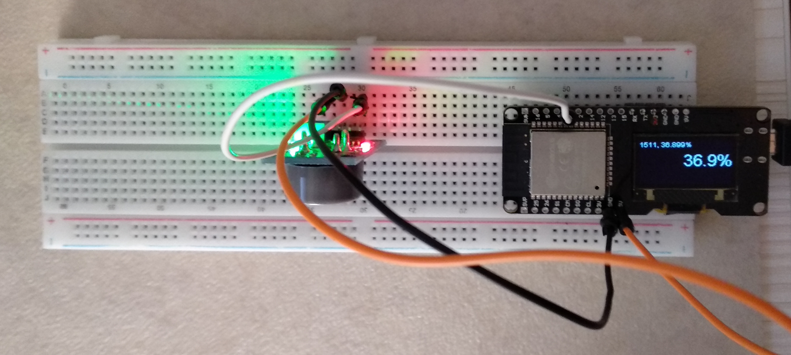

# ESP_MQ7_OLed_display
Test project for the ESP32 Oled display and MQ7 CO sensor

The code reads the sensor value periodically, converts it to a percent (assuming the input is 0V..5V) and displays it. Normally these things should get through a calibration phase, but it's easier to monitor the device and checkoud the limits by hand. The displayed value is actually a running average, to avoid temporary spikes.

In my case, the limits are:

 - 0..40% unusually clean air (the device display gets faded)
 - 40%..50% normal, in-house air (the device display gets a string lighness)
 - 50%..100% dirty/open the windows now  (the device display gets inverted)
 
If the values change too fast, then the delay between reads gets smaller, to adapt faster to the changing conditions.
 
 
 
Schematic
------------
It's this board https://www.aliexpress.com/item/1PC-Lolin-ESP32-OLED-Module-For-Arduino-ESP32-OLED-WiFi-Bluetooth-Dual-ESP-32-ESP-32S/32820916897.html
    
For help on how to configure it, use https://github.com/FablabTorino/AUG-Torino/wiki/Wemos-Lolin-board-(ESP32-with-128x64-SSD1306-I2C-OLED-display) , but Arduino IDE seems to simply need to add the corresponding board, and everything seems to work as expected

 
NOTE
------------

Please note that the sensors readings are not exactly accurate. I don't really know how they correlate with other gases (and they do according to the MQ7 specs).
If I'd follow https://www.detectcarbonmonoxide.com/co-health-risks/ then I should have serious health problems at 50% displayed by this device, because this would translate to about 1000ppm CO concentration (the MQ7 sensor reports Co concentration between 20ppm-2000ppm, on a somewhat linear slope, but dependant on temperature and humidity, and lots of other gases)

